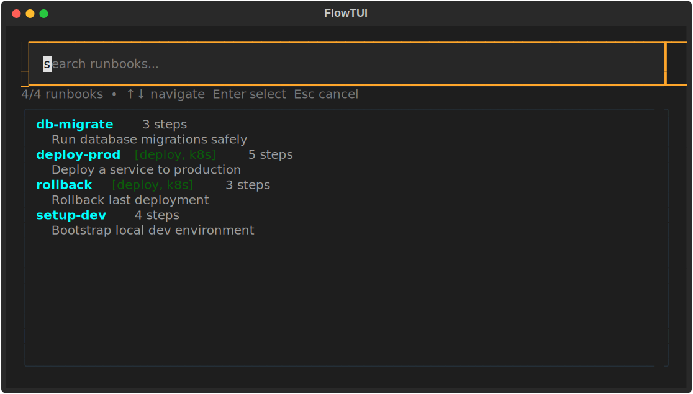
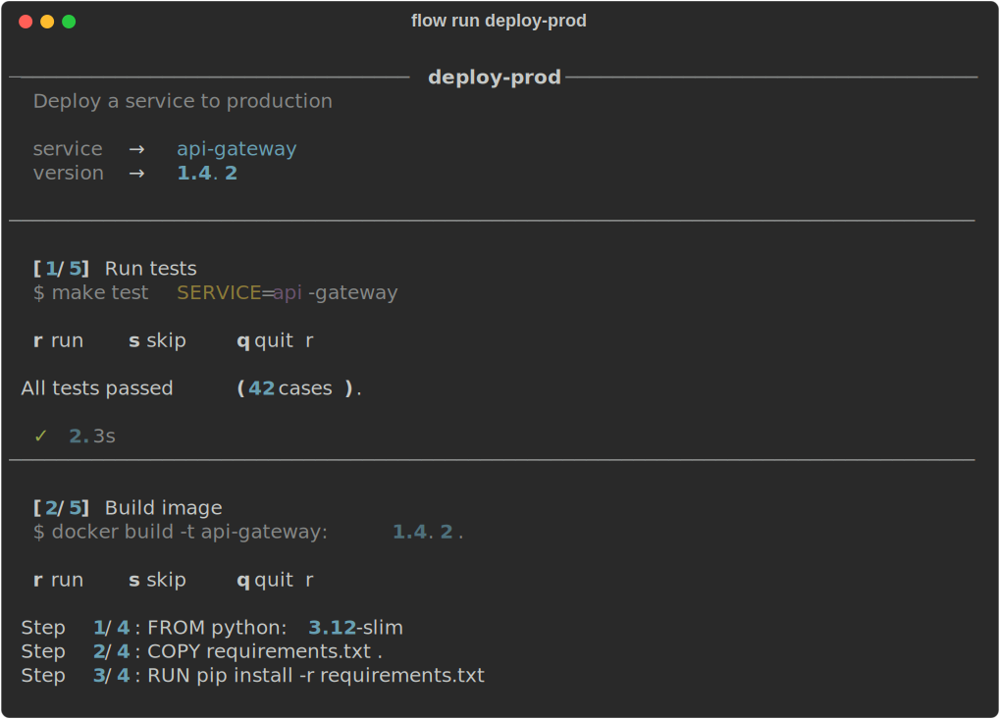
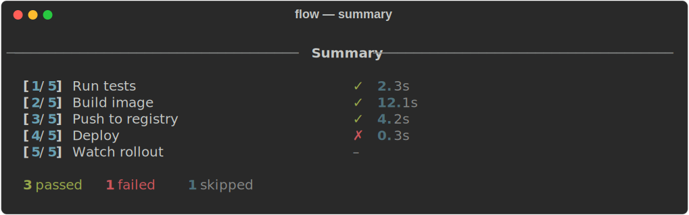
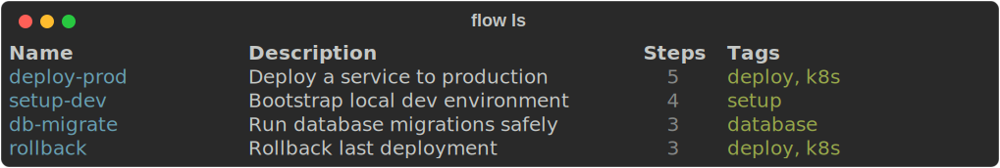

# flow

> An interactive runbook runner for the terminal.

Stop copy-pasting commands from Notion docs or half-broken shell scripts. `flow` lets you define multi-step runbooks in plain YAML, search them in seconds, and walk through each step interactively — with placeholder substitution, retry on failure, and a clean summary at the end.



---

## Features

- **Fuzzy search** across name, description, and tags
- **Placeholder substitution** — `{{variable}}` tokens collected once, reused across all steps
- **Step-by-step control** — run, skip, or quit at each step
- **Retry on failure** — re-run a failed step without restarting the whole runbook
- **Plain YAML storage** at `~/.flow/runbooks/` — easy to version-control or share
- **`$EDITOR` integration** — `flow new` and `flow edit` open YAML directly in your editor

---

## Install

```bash
git clone https://github.com/cfcata03/flow
cd flow
python3 -m venv .venv
.venv/bin/pip install -e .
```

Add `flow` to your PATH by appending this to `~/.zshrc` (or `~/.bashrc`):

```bash
export PATH="$HOME/flow/.venv/bin:$PATH"
```

Then reload: `source ~/.zshrc`

---

## Usage

### Interactive search (default)

```bash
flow
```

Opens the fuzzy TUI. Type to filter, `↑↓` to navigate, `Enter` to select. Variables are collected interactively before the first step runs.

---

### Create a runbook

```bash
flow new deploy-prod
```

Opens a YAML template in `$EDITOR`. Define your steps using `{{variable}}` for anything you want to fill in at runtime:

```yaml
name: deploy-prod
desc: Deploy a service to production
tags: [deploy, k8s]

steps:
  - name: Run tests
    cmd: make test SERVICE={{service}}

  - name: Build image
    cmd: docker build -t {{service}}:{{version}} .

  - name: Push to registry
    cmd: docker push registry.internal/{{service}}:{{version}}

  - name: Deploy
    cmd: kubectl set image deploy/{{service}} app={{service}}:{{version}} -n prod

  - name: Watch rollout
    cmd: kubectl rollout status deploy/{{service}} -n prod
```

---

### Run a runbook

```bash
flow run deploy-prod
```

Placeholders are collected once upfront, then substituted into every step:

```
  service: api-gateway
  version: 1.4.2
```

At each step you choose what to do:



---

### Summary

After the last step, `flow` prints a full summary with pass/fail/skip and timing per step:



---

### Other commands

```bash
flow ls              # list all runbooks
flow ls --tag k8s    # filter by tag
flow show <name>     # inspect steps and variables
flow edit <name>     # open runbook in $EDITOR
flow rm <name>       # delete a runbook
```



---

## Placeholder syntax

Any `{{word}}` in a `cmd` becomes a prompt at runtime. Duplicates are only asked once, even if they appear in multiple steps.

```yaml
steps:
  - name: Backup
    cmd: pg_dump {{db}} > backup.sql
  - name: Migrate
    cmd: python manage.py migrate --database={{db}}
  - name: Verify
    cmd: python manage.py check
```

```
  db: production
```

Both steps receive the same value.

---

## Storage

Runbooks live in `~/.flow/runbooks/<name>.yaml`. Plain YAML — commit them, symlink them, or sync them with any file-sync tool.

---

## Requirements

- Python 3.10+
- macOS / Linux
